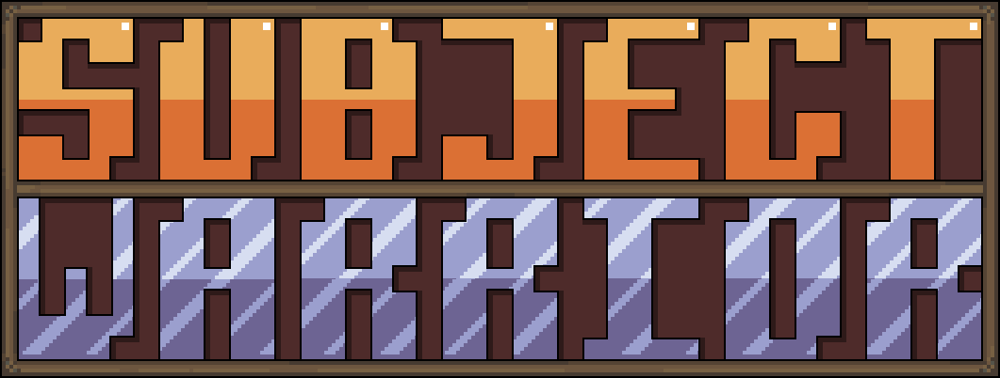

  

**Projeto Integrador - Jogo Educacional em 2D**

## 📖 **História**
O protagonista é um guerreiro que foi inserido em um universo desconhecido, na qual ele precisa passar de mundo em mundo derrotando chefes de cada matéria, para assim adquirir respostas e escapar.

## 🎯 **Mecânica**
Jogo no estilo 2D que foca na progressão de mundos, com mecânicas de plataforma e combate, além de perguntas ao final de cada mundo que testam o aprendizado do jogador, com auxílio de dicas colecionáveis.

## ✨ **Features**
- Chefes com padrões únicos
- Desafios de perguntas
- Progressão ao derrotar chefes
- Mundos temáticos referente a cada matéria

## 🏛️ **Pilares**
- **Desafio:** Combate intensivo com chefes, inimigos e perguntas no final de cada mundo
- **Aprendizagem:** Coletando dicas ao longo da fase que auxiliam na pergunta final

## 🎮 **Controles**
- **A / ←:** Mover para esquerda
- **D / →:** Mover para direita
- **ESPAÇO / W:** Pular

## ❓ **Como Jogar**
- Pule sobre os inimigos para eliminá-los
- Evite colisões laterais com os inimigos para não tomar dano
- Cada inimigo eliminado concede 100 pontos

## 💻 **Tecnologias Utilizadas**
- Allegro 5
- Linguagem C
- LibreSprite 
